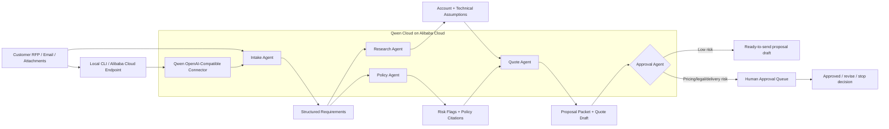

# Qwen Architecture Diagram

## Deployment Boundary

- Qwen model calls must run through Qwen Cloud.
- The local CLI exposes `--qwen-status` for connector verification and `--use-qwen` for the live call path after API-key setup.
- Backend deployment proof must come from Alibaba Cloud.
- The local demo can generate deterministic sample packets, but final Devpost copy should only claim live Qwen Cloud behavior after the deployed endpoint is verified.
