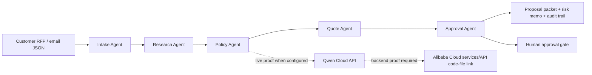

# Qwen Deadline Extension Confirmation

Public sources rechecked: 2026-07-10 KST.

Use this file before reopening the final Qwen packet after the July 8 deadline conflict.
It supersedes the Devpost header-versus-rules conflict in `submission/qwen-deadline-extension-arbitration.md`, and the July 10 recheck also resolves the earlier Qwen challenge-page key-date mismatch. Keep the same proof-quality stop lines.

## Event URL and Source Snapshot

- Devpost overview: https://qwencloud-hackathon.devpost.com/
- Devpost official rules: https://qwencloud-hackathon.devpost.com/rules
- Devpost resources: https://qwencloud-hackathon.devpost.com/resources
- Qwen Cloud challenge page: https://www.qwencloud.com/challenge/hackathon
- Devpost public header now shows `Deadline: Jul 20, 2026 @ 2:00pm PDT`.
- Devpost Official Rules section 1 now lists the Submission Period as May 26, 2026, 8:00 AM Pacific Time through July 20, 2026, 2:00 PM Pacific Time.
- Devpost public pages show about 7,343 participants during the current July 10 recheck.
- Qwen Cloud challenge page key dates now show the build period as May 26 to July 19 and the submission deadline as July 20, 2026.
- Devpost resources still say the last day to apply for the Qwen Cloud voucher is July 9 at 10AM PST.

## Deadline and Timezone

- Confirmed Devpost submission deadline: July 20, 2026, 2:00 PM PDT.
- Local KST conversion: July 21, 2026, 6:00 AM KST.
- UTC conversion: July 20, 2026, 9:00 PM UTC.
- Practical interpretation: the public deadline sources are now aligned to July 20, but voucher access, account setup, Qwen Cloud proof, and Alibaba Cloud proof may still be constrained by separate sponsor/platform timing.

## Eligibility and Account Requirements

- Entrant must be above the legal age of majority in their country or region and must not be in an excluded country or territory.
- Entrant must register or join the Devpost hackathon under their own identity.
- Entrant must sign up for Qwen Cloud, request any applicable hackathon voucher, join the official Discord if needed, create an API key, and keep all credentials outside the repository.
- Entrant must accept the official rules and make the final Devpost submission personally.

## Required Materials

- Public open-source code repository with visible license, source, assets, and setup instructions.
- Public repository code-file link demonstrating Alibaba Cloud services or APIs for backend deployment proof.
- Architecture diagram showing Qwen Cloud, backend, storage/state, frontend or CLI, and human approval gates.
- Public demo video, target under 3 minutes.
- Text description and track selection.
- Working project access through a website, functioning demo, or test build instructions for judges.
- Optional blog or social post link only if the entrant wants the blog prize.

## Judging Rubric Mapping

| Criterion | Weight | BidDesk evidence to emphasize |
| --- | --- | --- |
| Innovation & AI Creativity | 30% | Five-agent proposal workflow, Qwen-ready connector, policy and approval routing |
| Technical Depth & Engineering | 30% | Typed CLI, deterministic testable core, Qwen adapter, source snapshot and proof gates |
| Problem Value & Impact | 25% | Proposal teams turn messy RFPs into governed quote packets with fewer risky commitments |
| Presentation & Documentation | 15% | README, architecture diagram, demo script, Devpost draft, public-proof checklist |

## Product Concept

BidDesk Autopilot is a Track 4 Autopilot Agent entry with Track 3 Agent Society evidence. It converts messy customer requests and RFP fragments into proposal packets with intake, research, policy, quote, and approval agents. The core differentiator is governed autonomy: risky pricing, legal, delivery, or customer commitments require human approval before final output.

## Implementation Plan

1. Keep the deterministic local workflow as the reproducible judge baseline.
2. Add live Qwen proof only after the entrant supplies `QWEN_API_KEY` or `DASHSCOPE_API_KEY` outside the repo.
3. Add Alibaba Cloud proof only after the entrant deploys or prepares a backend proof code-file link.
4. Publish the repository, video, deck, and working project only under the entrant identity.
5. Paste final Devpost copy only after public URLs pass the smoke test.

## Architecture



## Local Setup

```bash
cd /Users/mac/hackathon-agent/biddesk-autopilot
uv sync --all-groups
uv run biddesk-autopilot reports/sample-request.json \
  --out reports/sample-proposal-packet.md \
  --json reports/sample-proposal-packet.json
python3 scripts/qwen-deadline-status.py --fail-after-deadline
bash scripts/submission-readiness.sh
```

## Demo Path

1. Show `reports/sample-request.json` with ambiguous commercial, security, integration, and deadline requirements.
2. Run the CLI and open `reports/sample-proposal-packet.md`.
3. Walk through intake, research, policy, quote, and approval outputs.
4. Show the approval gates for risky pricing, legal, delivery, and customer commitments.
5. If live Qwen proof exists, show redacted connector status and output.
6. If Alibaba Cloud proof exists, show the public code-file proof link and architecture diagram.

## Pitch Script

BidDesk Autopilot helps revenue teams answer messy RFPs without letting an agent make unsafe commitments. Specialized agents parse the request, add context, check policy, draft the quote, and route high-risk terms to humans. The result is a proposal packet, risk memo, and audit trail that is production-ready in shape even when the final deployment proof is still being captured.

## Submission Answers

- Title: `BidDesk Autopilot: Qwen-Powered Proposal Operations`
- Track: `Track 4: Autopilot Agent`
- Short description: `A Qwen-ready multi-agent system that turns messy RFPs and customer emails into compliant proposal packets with approval gates.`
- Proof boundary: claim live Qwen Cloud and Alibaba Cloud usage only after entrant-owned proof is captured and public URLs pass.

## Repository and Publication Plan

- Public repository: entrant-owned GitHub or GitLab URL with `README.md`, `LICENSE`, source code, tests, sample request, sample output, setup commands, architecture diagram, and proof notes.
- Video: public YouTube, Vimeo, or Youku URL, checked in private browser and kept under the stricter local 3-minute target.
- Deck or PDF: publish only if the Devpost form asks for it, using `submission/qwen-presentation-deck-outline.md`.
- Working project: provide a hosted URL, functioning demo, or reproducible local test-build instructions.

## Validation Results

- Passed on July 10, 2026 at 00:27 KST:
  - `python3 scripts/write-qwen-source-recheck-snapshot.py`
  - `python3 scripts/qwen-deadline-status.py --fail-after-deadline`
  - `bash scripts/submission-readiness.sh`
  - `bash scripts/prepare-qwen-submission-handoff.sh`
  - Zip and manifest verification for `qwen-post-extension-10-day-proof-sprint.md`, `qwen-source-recheck-snapshot.md`, and `qwen-final-operator-index.md`

## Risks

- The prior Qwen challenge-page key-date mismatch is resolved as of the July 10 KST recheck, but the Devpost resources page still lists the voucher request cutoff as July 9 at 10AM PST.
- Voucher request timing may be closed even though the Devpost submission deadline is July 20.
- Account, region, credit, security verification, API-key, Discord, and cloud deployment blockers remain entrant-owned.
- Public claims can become invalid if repository, video, working-project, Qwen proof, or Alibaba proof URLs are private, missing, or inconsistent.

## Exact External Blockers

- Devpost: login, `Join hackathon`, official rules acceptance, and final `Submit project`.
- Qwen Cloud: signup, voucher request, Discord join, API-key creation, billing or credit setup, and live API proof.
- Alibaba Cloud: deployment, region choice, service/API proof code-file, and any billable resource decision.
- Public hosts: repository publication, video upload, deck publication, blog/social post publication, and working-project hosting.
- Sensitive data: no API keys, account IDs, billing data, eligibility documents, tax data, real customer data, or personal information may be added to local artifacts.

## GO / DOWNGRADE / STOP

GO - confirmed Devpost extension path only if deadline status is active, public repository, public demo video, working-project access, Qwen Cloud proof, Alibaba Cloud proof, architecture diagram, and final fields are verified.

DOWNGRADE - use truthful Qwen-ready prototype wording if the Devpost form is open but live Qwen Cloud or Alibaba Cloud proof is incomplete.

STOP - external commitment required before account actions, publication actions, rules acceptance, credentials, cloud deployment, or final Devpost `Submit project`.
