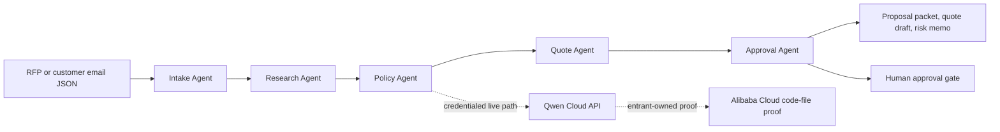

# Qwen Final Public Proof Evidence Lock

Public sources rechecked: 2026-07-11 KST / 2026-07-10 US.

Use this after `submission/qwen-source-recheck-snapshot.md`,
`submission/qwen-deadline-extension-confirmation.md`,
`submission/qwen-post-extension-10-day-proof-sprint.md`, and
`submission/qwen-judge-clean-room-rehearsal.md`. It locks the current public source state
to one final proof order before public repository publication, video upload, Devpost field
paste, rules acceptance, or final submit.

## Event URL and Source Snapshot

- Devpost overview: https://qwencloud-hackathon.devpost.com/
- Devpost official rules: https://qwencloud-hackathon.devpost.com/rules
- Devpost resources: https://qwencloud-hackathon.devpost.com/resources
- Qwen Cloud challenge page: https://www.qwencloud.com/challenge/hackathon
- Devpost overview header shows `Deadline: Jul 20, 2026 @ 2:00pm PDT`.
- Devpost overview shows about 7,502 participants; the rules page surface shows about
  7,504 participants. Treat this as about 7,500 participants for copy and competition
  positioning.
- Devpost Official Rules section 1 lists the Submission Period as May 26, 2026,
  8:00 AM Pacific Time through July 20, 2026, 2:00 PM Pacific Time.
- Devpost rules require Qwen Cloud usage, a public repository, text description,
  Alibaba Cloud deployment proof, architecture diagram, demo video, track selection,
  and working-project access for testing.
- Devpost rules specify Alibaba Cloud proof as a public repository code-file link that
  demonstrates Alibaba Cloud services and APIs.
- Devpost rules set the stricter demo-video gate: less than three minutes, publicly
  visible, and linked from the submission form.
- Devpost resources still say the last day to apply for the Qwen Cloud voucher is
  July 9 at 10AM PST.
- The Qwen Cloud challenge page says the submission deadline was extended to July 20,
  but coupon redemption remained July 9 at 11:59 PM GMT+7 and late coupon requests will
  not be accepted.
- The Qwen Cloud challenge page technical requirements say projects must use the Qwen
  Cloud API and be deployed on Alibaba Cloud infrastructure.

## Deadline and Timezone

- Confirmed submission deadline: July 20, 2026, 2:00 PM PDT.
- UTC conversion: July 20, 2026, 9:00 PM UTC.
- KST conversion: July 21, 2026, 6:00 AM KST.
- Practical phase: active post-extension submission window; prioritize proof capture,
  publication readiness, and truthful downgrade wording over new feature scope.

## Eligibility and Account Requirements

- Entrant must be above the legal age of majority and not excluded by official rules.
- Entrant must join the Devpost hackathon and accept official rules under their identity.
- Entrant must provide any team, organization, residency, tax, or prize details directly.
- Live Qwen Cloud claims require entrant-owned Qwen Cloud or DashScope credentials stored
  outside the repository.
- Alibaba Cloud deployment claims require entrant-owned deployment proof and a public
  repository code-file URL.
- Automation must stop before login, signup, voucher, API-key, billing, publication,
  rules acceptance, or final submit actions.

## Required Materials

- Public open-source repository with visible license, source, assets, sample data, and
  setup instructions.
- Public static demo page that gives judges a website view of the sample workflow and
  proof boundary without requiring credentials.
- Alibaba Cloud deployment proof as a public repository code-file link.
- Architecture diagram that shows Qwen Cloud, backend/deployment proof, state/data flow,
  CLI or frontend, and human approval gates.
- Public demo video under the Devpost rules threshold of less than three minutes.
- Text project description and Track 4 Autopilot Agent selection.
- Working-project access through a website, functioning demo, or reproducible test build.
- Optional blog or social post only if the entrant intentionally pursues that bonus prize.

## Judging Rubric Mapping

| Criterion | Weight | Evidence to lock before paste |
| --- | --- | --- |
| Innovation & AI Creativity | 30% | Five specialized agents and Qwen Cloud role mapping |
| Technical Depth & Engineering | 30% | Typed CLI, deterministic tests, Qwen adapter, proof gates |
| Problem Value & Impact | 25% | Proposal workflow with approval gates for risky commitments |
| Presentation & Documentation | 15% | README, architecture diagram, demo script, field lock, handoff bundle |

## Product Concept

BidDesk Autopilot is a Track 4 Autopilot Agent entry with Track 3 Agent Society evidence.
It turns messy RFP and customer email inputs into proposal packets, risk memos, quote
drafts, and approval questions. The judge-facing point is governed autonomy: the system
does useful proposal work while stopping before pricing, legal, delivery, or customer
commitments that require human approval.

## Implementation Plan

1. Keep the deterministic local CLI as the judge-reproducible baseline.
2. Run the no-network connector status path before any live proof claim.
3. Run the live Qwen path only after the entrant provides credentials outside the repo.
4. Add Alibaba Cloud proof only after the entrant has the deployment and public proof file.
5. Publish repository, video, deck, and working-project URLs only under the entrant identity.
6. Smoke test public URLs in a private browser before locking Devpost fields.
7. Paste final Devpost fields only after proof links match final claims.

## Architecture



## Local Setup

```bash
cd /Users/mac/hackathon-agent/biddesk-autopilot
uv sync --all-groups
uv run biddesk-autopilot reports/sample-request.json \
  --qwen-status \
  --out reports/sample-proposal-packet.md \
  --json reports/sample-proposal-packet.json
python3 scripts/qwen-deadline-status.py --fail-after-deadline
python3 scripts/write-qwen-source-recheck-snapshot.py
python3 scripts/write-qwen-judge-clean-room-rehearsal.py
bash scripts/submission-readiness.sh
```

## Demo Path

1. Open `reports/sample-request.json`.
2. Run the CLI and show `Qwen connector: not configured` or configured status without
   exposing secrets.
3. Open `reports/sample-proposal-packet.md`.
4. Show intake, research, policy, quote, and approval agents.
5. Show policy flags, quote lines, and human approval questions.
6. If live proof exists, show redacted Qwen Cloud output and Alibaba Cloud code-file proof.
7. If proof is missing, keep the Qwen-ready prototype wording.

## Pitch Script

BidDesk Autopilot helps proposal teams answer messy RFPs without letting an agent make
unsafe commitments. Five agents divide the work across intake, research, policy, quote,
and approval. The system produces a proposal packet and risk memo, but pricing, legal,
delivery, and customer promises stop at human approval gates.

## Submission Answers

- Title: `BidDesk Autopilot: Qwen-Powered Proposal Operations`
- Track: `Track 4: Autopilot Agent`
- Short description: `A Qwen-ready multi-agent proposal system that turns messy RFPs into
  governed proposal packets with human approval gates.`
- Built with: `Python, uv, Qwen Cloud target API, Alibaba Cloud target deployment,
  Markdown, JSON`
- Testing instructions fallback: `Run the README local setup commands. The sample request
  generates a proposal packet, JSON evidence, and clean-room rehearsal without credentials.`
- Truth boundary: `Live Qwen Cloud and Alibaba Cloud claims are included only when public
  proof links exist and pass smoke testing.`

## Repository and Publication Plan

- Publish `/Users/mac/hackathon-agent/biddesk-autopilot` only under the entrant identity.
- Include `README.md`, `LICENSE`, `src/`, `tests/`, `reports/sample-request.json`,
  generated sample outputs, `docs/index.html`, and the `submission/` evidence files.
- Run a local secret scan or manual scrub before public publication.
- Fill `submission/qwen-public-asset-ledger.md` only after public URLs exist.
- Run `submission/qwen-public-url-smoke-test.md` before `submission/qwen-devpost-field-lock.md`.
- Keep this file in the public repository so judges can see the proof-to-claim boundary.

## Validation Results

Passed on July 11, 2026 KST:

```bash
cd /Users/mac/hackathon-agent/biddesk-autopilot
python3 scripts/qwen-deadline-status.py --fail-after-deadline
python3 scripts/qwen-deadline-status.py --deadline-source rules --fail-after-deadline
python3 scripts/write-qwen-source-recheck-snapshot.py
python3 scripts/write-qwen-judge-clean-room-rehearsal.py
bash scripts/submission-readiness.sh
bash scripts/prepare-qwen-submission-handoff.sh
unzip -l submission/BidDesk-Autopilot-Qwen-handoff-bundle.zip | rg 'qwen-final-public-proof-evidence-lock|qwen-source-recheck-snapshot|qwen-final-operator-index'
rg -n 'qwen-final-public-proof-evidence-lock|Qwen Final Public Proof Evidence Lock' submission/qwen-handoff-bundle/manifest-sha256.txt submission/qwen-handoff-bundle/qwen-final-public-proof-evidence-lock.md
```

Observed status: deadline phase is `active submission window`, over 10 days remained,
six pytest tests passed, ruff passed, ty passed, readiness passed, the handoff bundle
regenerated, and the zip plus manifest both include this lock file.

## Risks

- Coupon access may be closed even though the Devpost submission deadline is still open.
- Qwen Cloud signup, required first-use terms, free-tier activation, API-key creation, and
  live `qwen-plus` inference completed on July 11, 2026 KST. See
  `qwen-live-call-evidence.md`; voucher profile fields and Discord remain external.
- Alibaba Cloud proof is eligibility-critical; do not claim deployed backend usage without
  public proof.
- Public repository and static web demo are published through the entrant-owned GitHub
  repository. Demo video, deck, and Alibaba-hosted working-project URLs still require
  entrant-owned publication.
- Devpost login, event registration, eligibility acceptance, and official rules acceptance
  completed on July 11, 2026 KST under `spdish12@gmail.com`.
- Devpost project creation is paused at an image CAPTCHA before the project record is
  created; final submission still requires the completed public proof set.

## Exact External Blockers

- Devpost image CAPTCHA, project creation, field completion, preview verification, and
  final `Submit project`. Login, event join, eligibility, and rules acceptance are complete.
- Qwen Cloud voucher/coupon profile fields and Discord join. Signup, free-tier activation,
  API-key creation, and live API proof are complete.
- Alibaba Cloud deployment, region choice, service/API proof code-file, and billable
  resource decisions.
- Public repository publication, public video upload, deck/PDF publication, optional
  blog/social post publication, and working-project hosting.
- Any personal, eligibility, team, billing, tax, customer, revenue, or confidential data.

## GO / DOWNGRADE / STOP

GO - continue with live Qwen submission only if deadline checks pass and public repository,
public video, architecture diagram, Qwen Cloud proof, Alibaba Cloud proof, and judge access
are all verified.

DOWNGRADE - use truthful Qwen-ready prototype wording if local and public assets exist but
live Qwen Cloud or Alibaba Cloud proof is incomplete.

STOP - external commitment required before login, account setup, voucher/coupon action,
credential creation, cloud deployment, publication, rules acceptance, or final Devpost
`Submit project`.
