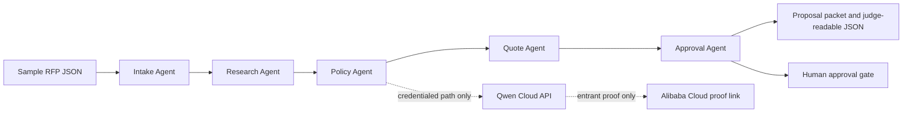

# Qwen Judge Clean-Room Rehearsal

Generated UTC: 2026-07-17T12:20:33+00:00

Use this after `submission/qwen-post-extension-10-day-proof-sprint.md` and before any
public URL publication. It rehearses the exact no-account path a judge can run if live
Qwen Cloud or Alibaba Cloud proof is not yet available.

## Event URL and Source Snapshot

- Devpost overview: https://qwencloud-hackathon.devpost.com/
- Devpost official rules: https://qwencloud-hackathon.devpost.com/rules
- Devpost resources: https://qwencloud-hackathon.devpost.com/resources
- Qwen Cloud challenge page: https://www.qwencloud.com/challenge/hackathon
- July 15, 2026 KST source state: Devpost overview, rules, and the Qwen challenge page
  align on the July 20, 2026 submission deadline.
- Current public Devpost surface observed in this run: about 7,883 participants.
- Voucher and live account access remain external because the Devpost resources page still
  shows the July 9, 10AM PST voucher request cutoff, and the Qwen challenge page says
  coupon redemption remained July 9 at 11:59 PM GMT+7.

## Deadline and Timezone

- Submission deadline: July 20, 2026, 2:00 PM PDT.
- UTC conversion: July 20, 2026, 9:00 PM UTC.
- KST conversion: July 21, 2026, 6:00 AM KST.
- Practical status: active post-extension window; local work should now favor judge-visible
  proof, not broader product scope.

## Eligibility and Account Requirements

- Entrant must join Devpost and accept official rules under their own identity.
- Entrant must provide any legal age, country, team, tax, or prize details directly.
- Live Qwen Cloud and Alibaba Cloud claims require entrant-owned accounts, keys, credits,
  and deployment proof.
- This rehearsal deliberately avoids login, API keys, cloud deployment, publication, and
  rules acceptance.

## Required Materials

- Public open-source repository with `README.md`, `LICENSE`, source, tests, sample input,
  sample output, and setup instructions.
- Alibaba Cloud backend deployment proof as a public repository code-file link.
- Architecture diagram, text description, Track 4 selection, and public demo video.
- Working-project access through a website, functioning demo, or reproducible test build.

## Judging Rubric Mapping

| Criterion | Weight | Clean-room evidence |
| --- | --- | --- |
| Technical Depth & Engineering | 30% | Typed CLI, tests, deterministic packet |
| Innovation & AI Creativity | 30% | Five agents with explicit Qwen roles |
| Problem Value & Impact | 25% | RFP workflow with approval gates |
| Presentation & Documentation | 15% | Rehearsal, README, demo script, diagram |

## Product Concept

BidDesk Autopilot turns messy RFP and customer email inputs into proposal packets, risk
memos, quote drafts, and human approval questions. The clean-room story is governed
autonomy: the system produces useful proposal work while stopping before pricing, legal,
delivery, or customer commitments.

## Implementation Plan

1. Keep the deterministic CLI path as the judge-reproducible fallback.
2. Publish the repository only after the entrant checks secrets and account data.
3. Add Qwen Cloud proof only after `QWEN_API_KEY` or `DASHSCOPE_API_KEY` is supplied
   outside the repository.
4. Add Alibaba Cloud proof only after the entrant has a public code-file proof link.
5. Lock final Devpost claims to either verified live proof or the truthful prototype wording.

## Architecture



## Local Setup

```bash
cd /Users/mac/hackathon-agent/biddesk-autopilot
uv sync --all-groups
uv run biddesk-autopilot reports/sample-request.json \
  --qwen-status \
  --out reports/sample-proposal-packet.md \
  --json reports/sample-proposal-packet.json
python3 scripts/write-qwen-judge-clean-room-rehearsal.py
uv run pytest
uv run ruff check .
uv run ty check src tests
```

## Demo Path

1. Open `reports/sample-request.json`.
2. Run the CLI command above and show `Qwen connector: not configured` or configured
   status without exposing secrets.
3. Open `reports/sample-proposal-packet.md`.
4. Show the five agent sections, policy flags, quote draft, and human approval questions.
5. Open this file and show the check table below.
6. If live proof exists, switch to the redacted Qwen and Alibaba proof artifacts; otherwise
   keep prototype wording.

## Pitch Script

This project gives judges a reproducible local baseline first. BidDesk Autopilot extracts
requirements, flags risky terms, drafts quote lines, and routes decisions to humans. The
Qwen Cloud path is wired, but live claims stay gated until the entrant supplies credentials
and Alibaba Cloud proof.

## Submission Answers

- Title: `BidDesk Autopilot: Qwen-Powered Proposal Operations`
- Track: `Track 4: Autopilot Agent`
- Short description: `A Qwen-ready multi-agent proposal system with deterministic
  clean-room judging and human approval gates.`
- Testing instructions fallback: `Run the local setup commands in the README. The sample
  request generates a proposal packet, JSON evidence, and this clean-room rehearsal without
  requiring credentials.`
- Truth boundary: `Live Qwen Cloud and Alibaba Cloud claims are included only when the
  submitted public proof links exist and pass smoke testing.`

## Repository and Publication Plan

- Publish `/Users/mac/hackathon-agent/biddesk-autopilot` under the entrant identity.
- Include this file, `reports/sample-request.json`, `reports/sample-proposal-packet.md`,
  `reports/sample-proposal-packet.json`, `README.md`, `LICENSE`, `src/`, and `tests/`.
- Do not publish API keys, account screenshots, billing data, customer data, or private
  credentials.
- Add final public repository, video, working-project, and Alibaba proof URLs only after
  private-browser smoke tests pass.

## Validation Results

| Check | Result | Evidence |
| --- | --- | --- |
| Five-agent workflow | PASS | `intake -> research -> policy -> quote -> approval` found in JSON output. |
| Qwen role mapping | PASS | Every agent step includes an explicit Qwen Cloud role for the live path. |
| Governance evidence | PASS | 3 policy flags and 3 approval questions. |
| Business value evidence | PASS | 5 requirement groups and 3 quote lines. |
| Judge clean-room path | PASS | Sample output is generated from local JSON with no external credential requirement. |

Observed local evidence:

- Customer: `Northstar Facilities`
- Track: `Track 4 Autopilot Agent with Track 3 Agent Society evidence`
- Requirements:
- single approval-ready proposal packet
- security questionnaire response with SOC2 evidence mapping
- line-item quote with assumptions and exclusions
- delivery timeline with customer-side dependencies
- integration scope and technical discovery checklist
- Policy flags:
- requires review for term: penalty
- requires review for term: custom integration
- legal review explicitly requested by customer
- Quote draft:
- Discovery and proposal validation: $10,200
- Implementation for 5 requirement groups: $46,750
- Governance, testing, and launch support: $15,300
- Human approval questions:
- Can sales commit to the proposed pricing range?
- Can legal accept the flagged terms or provide fallback language?
- Can delivery commit to the timeline after customer dependencies are confirmed?

## Risks

- No local rehearsal can satisfy the Qwen Cloud or Alibaba Cloud proof requirement by
  itself.
- Voucher timing may already be closed even though the Devpost submission window is open.
- A public repository, public video, and working-project path still require entrant-owned
  publication.
- Final form copy must not imply deployed cloud usage unless those proof links exist.

## Exact External Blockers

- Devpost login, `Join hackathon`, official rules acceptance, and final `Submit project`.
- Qwen Cloud signup, voucher/credit status, Discord, API-key creation, and live proof.
- Alibaba Cloud deployment, service/API proof code-file, and billable-resource decisions.
- Public repository, demo video, working-project hosting, and any account data.
- Presentation deck URL is now prepared through `docs/qwen-presentation.html` and
  `submission/BidDesk-Autopilot-Qwen-presentation.pptx`; verify it publicly after push.

## GO / DOWNGRADE / STOP

GO - use this rehearsal as judge testing evidence when local validation passes and public
repository/video/architecture links are available.

DOWNGRADE - keep Qwen-ready prototype wording if Qwen Cloud or Alibaba Cloud proof is absent.

STOP - external commitment required before login, publication, account setup, cloud deployment,
rules acceptance, or final Devpost submit.
