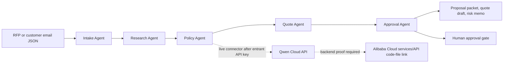

# Qwen Post-Extension 10-Day Proof Sprint

Public sources rechecked: 2026-07-10 KST.

Use this as the first execution sheet after `submission/qwen-source-recheck-snapshot.md` and `submission/qwen-deadline-extension-confirmation.md`. It converts the confirmed July 20 Devpost window into a proof-first sprint without loosening the live Qwen Cloud, Alibaba Cloud, public URL, or rules-acceptance stop lines.

## Event URL and Source Snapshot

- Devpost overview: https://qwencloud-hackathon.devpost.com/
- Devpost official rules: https://qwencloud-hackathon.devpost.com/rules
- Devpost resources: https://qwencloud-hackathon.devpost.com/resources
- Qwen Cloud challenge page: https://www.qwencloud.com/challenge/hackathon
- Devpost overview and rules page header show `Deadline: Jul 20, 2026 @ 2:00pm PDT`.
- Devpost Official Rules section 1 lists the Submission Period as May 26, 2026, 8:00 AM Pacific Time through July 20, 2026, 2:00 PM Pacific Time.
- Qwen Cloud challenge key dates now show May 26 to July 19 as the build period and July 20, 2026 as the submission deadline.
- Devpost public pages show about 7,343 participants during the current July 10 recheck.
- Devpost resources still say the last day to apply for the Qwen Cloud voucher is July 9 at 10AM PST, so credit access remains an account-level risk.

## Deadline and Timezone

- Submission deadline: July 20, 2026, 2:00 PM PDT.
- UTC conversion: July 20, 2026, 9:00 PM UTC.
- KST conversion: July 21, 2026, 6:00 AM KST.
- Local operating date for this sheet: July 10, 2026 KST.
- Practical phase: active post-extension submission window, roughly 10 days before the KST cutoff.

## Eligibility and Account Requirements

- Entrant must be above the legal age of majority in their country or region and not excluded by the official rules.
- Entrant must join the Devpost hackathon under their own identity and accept the official rules only after proof and public URL checks pass.
- Entrant must use Qwen models available on Qwen Cloud for final live claims.
- Entrant must create or use their own Qwen Cloud and Alibaba Cloud accounts, store API keys outside the repository, and avoid committing secrets.
- Any voucher, billing, region, Discord, account verification, or prize/tax data remains entrant-owned.

## Required Materials

- Public open-source repository with visible license, source, assets, and setup instructions.
- Public repository code-file link demonstrating Alibaba Cloud services or APIs for backend deployment proof.
- Architecture diagram showing Qwen Cloud, backend, state/storage, CLI or frontend, and human approval gates.
- Public demo video under 3 minutes, uploaded to an allowed public video host.
- Text description explaining project features and functionality.
- Track selection, with Track 4 Autopilot Agent as the primary track.
- Judge access through a website, functioning demo, or reproducible test build instructions.
- Optional blog or social post only if pursuing the blog prize.

## Judging Rubric Mapping

| Criterion | Weight | BidDesk proof to surface |
| --- | --- | --- |
| Innovation & AI Creativity | 30% | Five specialized agents, Qwen-ready live connector, governed quote automation |
| Technical Depth & Engineering | 30% | Typed CLI, deterministic test baseline, Qwen adapter, source/deadline tooling, proof gates |
| Problem Value & Impact | 25% | Proposal teams reduce manual RFP effort while keeping legal, pricing, and delivery commitments gated |
| Presentation & Documentation | 15% | README, architecture diagram, demo script, Devpost draft, handoff bundle, public URL checks |

## Product Concept

BidDesk Autopilot is a Track 4 Autopilot Agent entry with Track 3 Agent Society evidence. It turns messy RFP and customer email inputs into proposal packets, risk memos, quote drafts, and approval questions. The standout angle is governed autonomy: agents can draft and route work, but pricing, legal, delivery, and customer commitments stop at explicit human approval gates.

## Implementation Plan

1. Keep the deterministic local CLI as the judge-reproducible baseline.
2. Run the guarded Qwen connector only after entrant-owned `QWEN_API_KEY` or `DASHSCOPE_API_KEY` exists outside the repository.
3. Capture Alibaba Cloud proof as a public code-file link that demonstrates Alibaba Cloud services or APIs.
4. Publish repository, video, deck, and any hosted working project only under the entrant identity.
5. Fill public URL ledger, smoke test in a private browser, then lock Devpost fields.
6. Accept rules and click final submit only after every required proof is public, consistent, and truthful.

## Architecture



## Local Setup

```bash
cd /Users/mac/hackathon-agent/biddesk-autopilot
uv sync --all-groups
uv run biddesk-autopilot reports/sample-request.json \
  --out reports/sample-proposal-packet.md \
  --json reports/sample-proposal-packet.json
python3 scripts/qwen-deadline-status.py --fail-after-deadline
python3 scripts/write-qwen-source-recheck-snapshot.py
bash scripts/submission-readiness.sh
```

## Demo Path

1. Open `reports/sample-request.json` and show the ambiguous RFP, security, integration, timeline, and budget signals.
2. Run the CLI and open `reports/sample-proposal-packet.md`.
3. Show each agent section: intake, research, policy, quote, and approval.
4. Point out policy flags and human approval questions before any risky commitment is sent.
5. If live Qwen proof exists, show redacted connector output and the generated `Qwen Cloud Live Summary`.
6. If Alibaba Cloud proof exists, show the public proof code-file link and architecture diagram.

## Pitch Script

BidDesk Autopilot helps revenue teams respond to messy RFPs without letting an agent make unsafe commitments. Five specialized agents extract requirements, prepare context, check policy, draft quote lines, and route risky decisions to humans. The project is production-shaped because it separates useful autonomy from legal, pricing, delivery, and customer commitments that require approval.

## Submission Answers

- Title: `BidDesk Autopilot: Qwen-Powered Proposal Operations`
- Track: `Track 4: Autopilot Agent`
- Short description: `A Qwen-ready multi-agent system that turns messy RFPs and customer emails into compliant proposal packets with human approval gates.`
- Built with: `Python, uv, Qwen Cloud target API, Alibaba Cloud target deployment, Markdown, JSON`
- Truth boundary: claim live Qwen Cloud and Alibaba Cloud usage only after entrant-owned proof is captured and the public URLs pass.
- Prototype fallback: `This submission includes a deterministic local baseline and a guarded Qwen Cloud connector path; live Qwen Cloud and Alibaba Cloud claims are limited to captured entrant-owned proof.`

## Repository and Publication Plan

- Publish `/Users/mac/hackathon-agent/biddesk-autopilot` as a public open-source repository under the entrant identity.
- Ensure `README.md`, `LICENSE`, `src/`, `tests/`, `reports/sample-request.json`, `reports/sample-proposal-packet.md`, and `submission/` proof files are visible.
- Add public proof notes only after secret scans confirm no API keys, billing data, or private account identifiers are present.
- Record a public demo from `submission/qwen-demo-script.md`, keep it under 3 minutes, and verify playback in a private browser.
- Use `submission/qwen-presentation-deck-outline.md` only if the Devpost form asks for a deck or PDF URL.
- Fill `submission/qwen-public-asset-ledger.md` before `submission/qwen-public-url-smoke-test.md` and `submission/qwen-devpost-field-lock.md`.

## 10-Day Proof Sprint

| When | Proof objective | Local file to keep open | Stop line |
| --- | --- | --- | --- |
| July 10-11 KST | Confirm deadline/source alignment and regenerate handoff bundle | This file, `qwen-source-recheck-snapshot.md` | Stop before external account actions |
| July 10-11 KST | Rehearse the judge clean-room path and lock fallback testing instructions | `qwen-judge-clean-room-rehearsal.md` | Stop before public URL publication |
| July 11-13 KST | Public repository readiness and secret scan | `qwen-public-asset-ledger.md` | Stop before publishing under entrant identity |
| July 13-15 KST | Qwen Cloud live proof or truthful prototype downgrade | `qwen-live-connector-gate.md` | Stop before API key creation or billing |
| July 15-17 KST | Alibaba Cloud proof or downgrade wording | `qwen-deployment-proof-gate.md` | Stop before billable deployment decisions |
| July 17-18 KST | Demo recording and under-3-minute video check | `qwen-recording-evidence-capture.md` | Stop before public upload |
| July 18-19 KST | Public URL smoke test and Devpost field lock | `qwen-public-url-smoke-test.md` | Stop before rules acceptance |
| July 20 KST | Final paste rehearsal and entrant-owned submit session | `qwen-final-devpost-submit-runbook.md` | Stop before final `Submit project` click |

## Validation Results

Passed on July 10, 2026 at 00:27 KST:

```bash
cd /Users/mac/hackathon-agent/biddesk-autopilot
python3 scripts/qwen-deadline-status.py --fail-after-deadline
python3 scripts/write-qwen-source-recheck-snapshot.py
bash scripts/submission-readiness.sh
bash scripts/prepare-qwen-submission-handoff.sh
unzip -l submission/BidDesk-Autopilot-Qwen-handoff-bundle.zip | rg 'qwen-post-extension-10-day-proof-sprint|qwen-source-recheck-snapshot|qwen-final-operator-index'
rg -n 'qwen-post-extension-10-day-proof-sprint|Qwen Post-Extension' submission/qwen-handoff-bundle/manifest-sha256.txt submission/qwen-handoff-bundle/qwen-post-extension-10-day-proof-sprint.md
```

Observed status: deadline phase is `active submission window`, remaining time was `11d 5h 32m`, six pytest tests passed, ruff and ty checks passed, readiness passed, handoff bundle regenerated, and the zip plus manifest both include this file.

## Risks

- Voucher access may be closed because Devpost resources still list July 9 at 10AM PST as the voucher request cutoff.
- Account region, credit, security verification, Discord, API-key, and billing boundaries remain outside local automation.
- Alibaba Cloud proof is eligibility-critical; no proof means final copy must not claim deployed backend usage.
- Public repository, video, deck, and working-project URLs can only be created under the entrant identity.
- Final Devpost submission requires rules acceptance and a final external commitment by the entrant.

## Exact External Blockers

- Devpost login, `Join hackathon`, official rules acceptance, and final `Submit project`.
- Qwen Cloud signup, voucher request, Discord join, API-key creation, billing or credit setup, and live API proof.
- Alibaba Cloud deployment, region choice, service/API proof code-file, and any billable resource decision.
- Public repository publication, public demo video upload, deck/PDF publication, blog/social post publication, and working-project hosting.
- Any personal, eligibility, billing, tax, customer, revenue, or confidential data required by external services.

## GO / DOWNGRADE / STOP

GO - continue toward a live Qwen submission only if the deadline check is active and public repository, public video, architecture diagram, Qwen Cloud proof, Alibaba Cloud proof, and judge access are all verified.

DOWNGRADE - use truthful Qwen-ready prototype wording if public assets exist but live Qwen Cloud or Alibaba Cloud proof is missing.

STOP - external commitment required before account actions, credential creation, cloud deployment, publication, rules acceptance, or final Devpost `Submit project`.
